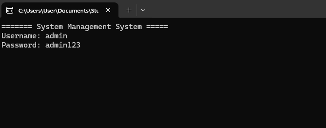
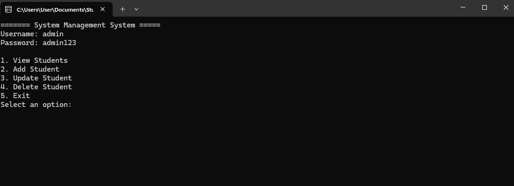
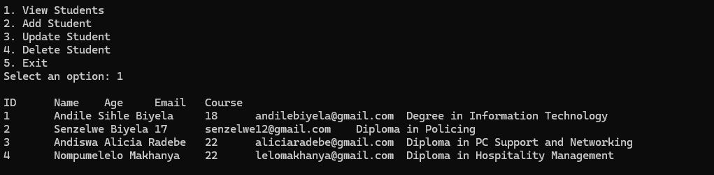
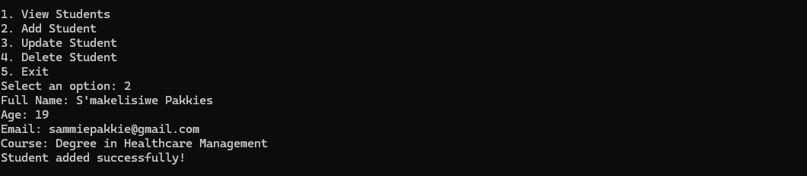
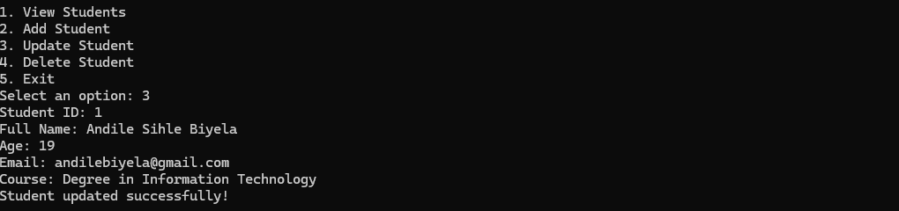
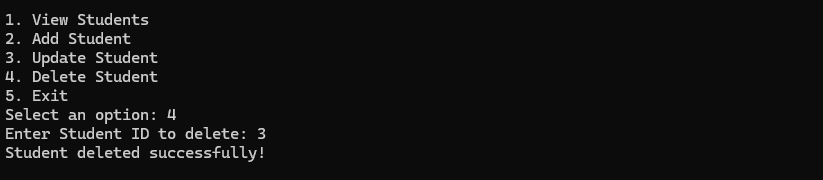

# Student Management System

A simple console-based student management system built in C# with SQL Server, featuring:

- Role-based login (Admin, Teacher, Student)
- Hashed and salted passwords
- CRUD operations for students (view, add, update, delete)

---

## Tech Stack

- C# (.NET 6+)
- SQL Server
- Microsoft.Data.SqlClient
- Console Application

---

## Screenshots

**Login Screen**  

**Menu**

**View Students**  

**Add Student**  

**Update Student**  

**Delete Student**  

---

## Default Admin Login

Username: admin
Password: admin123

---

## Project Structure

StudentManagementSystem/
│
├── src/
│   ├── Program.cs
│   ├── StudentOperations.cs
│   └── PasswordHelper.cs
│
├── SQL/
│   └── CreateStudentDB.sql       # SQL script to create Users & Students tables
│
├── screenshots/
│   ├── login.png
│   ├── menu.png
│   ├── view_students.png
│   ├── add_student.png
│   ├── update_student.png
│   └── delete_student.png
│
├── .gitignore
└── README.md

## Author

Neliswa Biyela

Junior Software Developer
